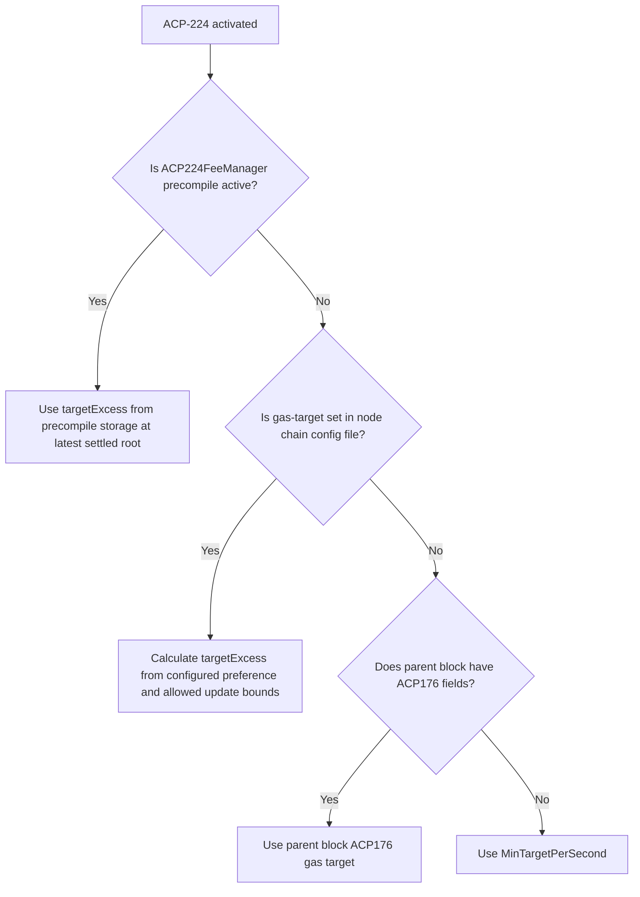

| ACP | 224 |
| :--- | :--- |
| **Title** | Introduce ACP-176-Based Dynamic Gas Limits and Fee Manager Precompile in Subnet-EVM  |
| **Author(s)** | Ceyhun Onur ([@ceyonur](https://github.com/ceyonur)), Michael Kaplan ([@michaelkaplan13](https://github.com/michaelkaplan13)) |
| **Status** | Proposed ([Discussion](https://github.com/avalanche-foundation/ACPs/discussions/230)) |
| **Track** | Standards |

## Abstract

Proposes implementing [ACP-176](https://github.com/avalanche-foundation/ACPs/blob/aa3bea24431b2fdf1c79f35a3fd7cc57eeb33108/ACPs/176-dynamic-evm-gas-limit-and-price-discovery-updates/README.md) in Subnet-EVM, along with the addition of a new optional `ACP224FeeManagerPrecompile` that can be used to configure fee parameters on-chain dynamically after activation, in the same way that the existing `FeeManagerPrecompile` can be used today prior to ACP-176.

## Motivation

ACP-176 updated the EVM dynamic fee mechanism to more accurately achieve the target gas consumption on-chain. It also added a mechanism for the target gas consumption rate to be dynamically updated. Until now, ACP-176 was only added to Coreth (C-Chain), primarily because most L1s prefer to control their fees and gas targets through the `FeeManagerPrecompile` and `FeeConfig` in genesis chain configuration, and the existing `FeeManagerPrecompile` is not compatible with the ACP-176 fee mechanism.

[ACP-194](https://github.com/avalanche-foundation/ACPs/blob/aa3bea24431b2fdf1c79f35a3fd7cc57eeb33108/ACPs/194-streaming-asynchronous-execution/README.md) (SAE) depends on having a gas target and capacity mechanism aligned with ACP-176. Specifically, there must be a known gas capacity added per second, and maximum gas capacity. The existing windower fee mechanism employed by Subnet-EVM does not provide these properties because it does not have a fixed capacity rate, making it difficult to calculate worst-case bounds for gas prices. As such, adding ACP-176 into Subnet-EVM is a functional requirement for L1s to be able to use SAE in the future. Adding ACP-176 fee dynamics to Subnet-EVM also has the added benefit of aligning with Coreth such that only a single mechanism needs to be maintained on a go-forwards basis.

While both ACP-176 and ACP-194 will be required upgrades for L1s, this ACP aims to provide similar controls for chains with a new precompile. A new dynamic fee configuration and fee manager precompile that maps well into the ACP-176 mechanism will be added, optionally allowing admins to adjust fee parameters dynamically.

## Specification

### ACP-176 Parameters

This ACP uses the same parameters as in the [ACP-176 specification](https://github.com/avalanche-foundation/ACPs/blob/main/ACPs/176-dynamic-evm-gas-limit-and-price-discovery-updates/README.md#configuration-parameters), and allows their values to be configured on a chain-by-chain basis. The parameters and their current values used by the C-Chain are as follows:

| Parameter | Description | C-Chain Configuration |
| :--- | :--- | :--- |
| $T$ | target gas consumed per second | dynamic |
| $R$ | gas capacity added per second | 2*T |
| $C$ | maximum gas capacity | 10*T |
| $P$ | minimum target gas consumption per second | 1,000,000 |
| $D$ | target gas consumption rate update constant | 2^25 |
| $Q$ | target gas consumption rate update factor change limit | 2^15 |
| $M$ | minimum gas price | 1 Wei (10^-18 AVAX) |
| $K$ | gas price update constant ($KMult * T$) | 87*T |

### Prior Subnet-EVM Fee Configuration Parameters

Prior to this ACP, the Subnet-EVM fee configuration and fee manager precompile used the following parameters to control the fee mechanism:

**GasLimit**:
  Sets the max amount of gas consumed per block.

**TargetBlockRate**:
  Sets the target rate of block production in seconds used for fee adjustments. If the actual block rate is faster than this target, block gas cost will be increased, and vice versa.

**MinBaseFee**:
  The minimum base fee sets a lower bound on the EIP-1559 base fee of a block. Since the block's base fee sets the minimum gas price for any transaction included in that block, this effectively sets a minimum gas price for any transaction.

**TargetGas**:
  Specifies the targeted amount of gas (including block gas cost) to consume within a rolling 10s window. When the dynamic fee algorithm observes that network activity is above/below the `TargetGas`, it increases/decreases the base fee proportionally to how far above/below the target actual network activity is.

**BaseFeeChangeDenominator**:
  Divides the difference between actual and target utilization to determine how much to increase/decrease the base fee. A larger denominator indicates a slower changing, stickier base fee, while a lower denominator allows the base fee to adjust more quickly.

**MinBlockGasCost**:
  Sets the minimum amount of gas to charge for the production of a block.

**MaxBlockGasCost**:
  Sets the maximum amount of gas to charge for the production of a block.

**BlockGasCostStep**:
  Determines how much to increase/decrease the block gas cost depending on the amount of time elapsed since the previous block. If the block is produced at the target rate, the block gas cost will stay the same as the block gas cost for the parent block. If it is produced faster/slower, the block gas cost will be increased/decreased by the step value for each second faster/slower than the target block rate accordingly.
  Note: if the `BlockGasCostStep` is set to a very large number, it effectively requires block production to go no faster than the `TargetBlockRate`.
  Ex: if a block is produced two seconds faster than the target block rate, the block gas cost will increase by `2 * BlockGasCostStep`.

### ACP-176 Parameters in Subnet-EVM

ACP-176 will make `GasLimit` and `BaseFeeChangeDenominator` configurations obsolete in Subnet-EVM.

`TargetBlockRate`, `MinBlockGasCost`, `MaxBlockGasCost`, and `BlockGasCostStep` will be also removed by [ACP-226](https://github.com/avalanche-foundation/ACPs/tree/ce51dfab/ACPs/226-dynamic-minimum-block-times).

`MinGasPrice` is equivalent to `M` in ACP-176 and will be used to set the minimum gas price for ACP-176. This is similar to `MinBaseFee` in old Subnet-EVM fee configuration, and roughly gives the same effect. Currently the default value is `25 * 10^-9 AVAX` (25 nAVAX / 25 Gwei). This default will be changed to the minimum possible denomination of the native EVM asset (1 Wei), which is aligned with the C-Chain.

`TargetGas` is equivalent to `T` (target gas consumed per second) in ACP-176 and will be used to set the target gas consumed per second for ACP-176.

`TimeToDouble` will be used to control the speed of the fee adjustment. In ACP-176, the gas price update constant $K$ is defined as $K = KMult \cdot T$, where $T$ is the target gas per second and $KMult$ is a multiplier. The `TimeToDouble` parameter configures $KMult$ directly via the relationship $KMult = \frac{TimeToDouble}{ln(2)}$. The default value for `TimeToDouble` is 60 seconds, yielding $KMult = \frac{60}{ln(2)} \approx 87$, which is aligned with the C-Chain (where $K = 87 \cdot T$). At sustained maximum capacity ($2T$ gas/second), this results in the gas price doubling approximately every 60 seconds.

As a result parameters will be set as follows:

| Parameter | Description | Default Value | Is Configurable |
| :--- | :--- | :--- | :--- |
| $T$ | target gas consumed per second | 1,000,000 | :white_check_mark: |
| $R$ | gas capacity added per second | 2*T | :x:
| $C$ | maximum gas capacity | 10*T | :x:
| $P$ | minimum target gas consumption per second | 1,000,000 | :x:
| $D$ | target gas consumption rate update constant | 2^25 | :x:
| $Q$ | target gas consumption rate update factor change limit | 2^15 | :x:
| $M$ | minimum gas price | 1 Wei | :white_check_mark:
| $K$ | gas price update constant ($KMult \cdot T$) | ~87*T | :white_check_mark: Through `TimeToDouble` (default 60s equivalent to $KMult \approx 87$)$

The gas capacity added per second (`R`) always being equal to `2*T` keeps it such that the gas price is capable of increase and decrease at the same rate. The values of `Q` and `D` affect the magnitude of change to `T` that each block can have, and the granularity at which the target gas consumption rate can be updated. The proposed values match the C-Chain, allowing each block to modify the current gas target by roughly $\frac{1}{1024}$ of its current value. This has provided sufficient responsiveness and granularity as is, removing the need to make `D` and `Q` dynamic or configurable. Similarly, 1,000,000 gas/second should be a low enough minimum target gas consumption for any EVM L1. The target gas for a given L1 will be able to be increased from this value dynamically and has no maximum.

#### Max Capacity Factor (C) Design Rationale

The maximum gas capacity (`C`) is intentionally not configurable for L1s. [ACP-194 (SAE)](https://github.com/avalanche-foundation/ACPs/tree/main/ACPs/194-streaming-asynchronous-execution#block-size) defines the max gas capacity (i.e., max block size/block gas limit) as $2 \cdot T \cdot \tau \cdot \lambda$, where $\tau$ is the constant delay and $\lambda$ is the inverse of the minimum percentage of the gas limit charged. This definition ensures that the transaction queue can always be fully saturated. This means that the max capacity of the C-Chain will actually double upon ACP-194 activation, since it is currently $2 \cdot T \cdot 5$ and it will become $2 \cdot T \cdot 5 \cdot 2$.

The original motivation to make this configurable was to allow for very high maximum gas usage by a single block, primarily to support large contract deployments. Given that SAE will be activated at the same time as ACP-224, the max capacity of the C-Chain will double upon activation, further reducing the need for configurability. Additionally Ethereum's Fusaka upgrade introduces a maximum transaction gas limit of $2^{24}$ (~16.7M), which makes this concern largely moot.

Given these considerations, `C` was changed to not be parametrizable for L1s because:

1. SAE provides clear rationale for the max capacity value (ensuring the transaction queue can always be fully saturated).
2. The future maximum transaction gas limit of 16.7M makes large contract deployments less of a concern.
3. There are very limited benefits to allowing `C` to be higher than the SAE-defined value in the future.
4. It's still a function of `T`, so it can be adjusted dynamically via the `ACP224FeeManagerPrecompile` if needed.

### Dynamic Gas Target Via Validator Preference

For L1s that want their gas target to be dynamically adjusted based on the preferences of their validator sets, the same mechanism introduced on the C-Chain in ACP-176 will be employed. Validators will be able to set their `gas-target` preference in their node's configuration, and block builders can then adjust the target excess in blocks that they propose based on their preference.

### ACP224FeeManagerPrecompile

#### Solidity Interface

The `ACP224FeeManagerPrecompile` provides an on-chain interface for managing fee parameters dynamically.

The precompile offers similar controls as the existing `FeeManagerPrecompile` implemented in Subnet-EVM [here](https://github.com/ava-labs/subnet-evm/tree/53f5305/precompile/contracts/feemanager). The solidity interface is as follows:

```solidity
//SPDX-License-Identifier: MIT
pragma solidity ^0.8.24;
import "./IAllowList.sol";

/// @title ACP-224 Fee Manager Interface
/// @notice Interface for managing dynamic gas limit and fee parameters
/// @dev Inherits from IAllowList for access control
interface IACP224FeeManager is IAllowList {
    /// @notice Configuration parameters for the dynamic fee mechanism
    struct FeeConfig {
        uint256 targetGas;       // Target gas consumption per second (T)
        uint256 minGasPrice;     // Minimum gas price in wei (M)
        uint256 timeToDouble;    // Seconds for gas price to double at max capacity
    }

    /// @notice Emitted when fee configuration is updated
    /// @param sender Address that triggered the update
    /// @param oldFeeConfig Previous configuration
    /// @param newFeeConfig New configuration
    event FeeConfigUpdated(address indexed sender, FeeConfig oldFeeConfig, FeeConfig newFeeConfig);

    /// @notice Set the fee configuration
    /// @param config New fee configuration parameters
    function setFeeConfig(FeeConfig calldata config) external;

    /// @notice Get the current fee configuration
    /// @return config Current fee configuration
    function getFeeConfig() external view returns (FeeConfig memory config);

    /// @notice Get the block number when fee config was last changed
    /// @return blockNumber Block number of last configuration change
    function getFeeConfigLastChangedAt() external view returns (uint256 blockNumber);
}
```
For chains with the precompile activated, `setFeeConfig` can be used to dynamically change each of the values in the fee configurations. Importantly, any updates made via calls to `setFeeConfig` in a transaction will take effect only as of _settlement_ of the transaction, not as of _acceptance_ or _execution_ (for transaction life cycles/status, refer to ACP-194 [here](https://github.com/avalanche-foundation/ACPs/tree/61d2a2a/ACPs/194-streaming-asynchronous-execution#description)). This ensures that all nodes apply the same worst-case bounds validation on transactions being accepted into the queue, since the worst-case bounds are affected by changes to the fee configuration.

#### Initial Fee Configuration

All fee configuration for ACP-224 is done through the `ACP224FeeManagerPrecompile`. There is no separate genesis chain configuration for the new fee parameters. If the precompile is not activated at all, or no `initialFeeConfig` is provided, default values aligned with the C-Chain are used.

The precompile can be activated with an `initialFeeConfig` to set the initial fee parameters at the activation timestamp. This follows the established Subnet-EVM pattern for [initial precompile configurations](https://build.avax.network/docs/avalanche-l1s/evm-configuration/customize-avalanche-l1#initial-precompile-configurations). If no admin, manager, or enabled addresses are provided, the precompile becomes **read-only**: `getFeeConfig`, `getFeeConfigLastChangedAt` remain callable, but `setFeeConfig` reverts. In this case the precompile has to be disabled and re-enabled with the desired admin, manager, or enabled addresses to change them.

When `initialFeeConfig` is present, all three uint fields (`targetGas`, `minGasPrice`, `timeToDouble`) are **required**. This prevents silent misconfiguration from typos (e.g., a misspelled `"minGasprice"` would otherwise silently fall back to a default, potentially making the chain near-free to spam).

The precompile configuration will look like the following:

```json
{
  "acp224FeeManagerConfig": {
    "blockTimestamp": <activation_timestamp>,
    "adminAddresses": ["0x..."],
    "managerAddresses": ["0x..."],
    "enabledAddresses": ["0x..."],
    "initialFeeConfig": {
      "targetGas": 2000000,
      "minGasPrice": 25000000000,
      "timeToDouble": 60,
    }
  }
}
```

The `initialFeeConfig` fields are:

- `targetGas` (uint64, **required**): Target gas consumption per second ($T$).
- `minGasPrice` (uint64, **required**): Minimum gas price in wei ($M$).
- `timeToDouble` (uint64, **required**): Seconds for the gas price to double when the chain is at maximum capacity. Determines $K$ as described in [ACP-176 Parameters in Subnet-EVM](#acp-176-parameters-in-subnet-evm).

#### Example Configurations

**Custom fees, fully locked (read-only precompile, dynamic pricing):**

```json
{
  "acp224FeeManagerConfig": {
    "blockTimestamp": <activation_timestamp>,
    "initialFeeConfig": {
      "targetGas": 5000000,
      "minGasPrice": 25000000000,
      "timeToDouble": 60
    }
  }
}
```

No admin addresses means the precompile is read-only. All boolean flags default to `false`: dynamic pricing is active, and the precompile controls `targetGas`.

#### Internal State

In addition to storing the latest fee configuration to be returned by `getFeeConfig`, the precompile will also maintain state storing the latest values of $q$ (the target excess) and $KMult$. These values can be derived from the `targetGas` and `timeToDouble` values given to the precompile, respectively. The value of $q$ can be deterministically calculated using the same method as Coreth currently employs to calculate a node's desired target excess [here](https://github.com/ava-labs/coreth/blob/b4c8300490afb7f234df704fdcc446f227e4ec2f/plugin/evm/upgrade/acp176/acp176.go#L170). Similarly, $KMult$ is approximated directly from `timeToDouble` according to:

$$ KMult = \frac{TimeToDouble}{ln(2)} $$
where $ln(2) \approx 0.69$

The resulting ACP-176 gas price update constant is then $K = KMult \cdot T$. Note that `timeToDouble` is the user-facing configuration parameter, while $KMult$ is the internally derived multiplier. When $T$ changes (via `setFeeConfig` or validator preferences), $K$ adjusts proportionally since $KMult$ remains fixed.

Similar to the [desired target excess calculation in Coreth](https://github.com/ava-labs/coreth/blob/0255516f25964cf4a15668946f28b12935a50e0c/plugin/evm/upgrade/acp176/acp176.go#L170), which takes a node's desired gas target and calculates its desired target excess value, the `ACP224FeeManagerPrecompile` will use binary search to determine the resulting dynamic target excess value given the `targetGas` value passed to `setFeeConfig`. All blocks accepted after the settlement of such a call must have the correct target excess value as derived from the binary search result.

Block building logic can follow the below diagram for determining the target excess of blocks.


#### Adjustment to ACP-176 calculations for price discovery

ACP-176 defines the gas price for a block as:

$$gas\_price = M \cdot e^{\frac{x}{K}}$$

Now, whenever $M$ (`minGasPrice`) or $K$ (derived from `timeToDouble`) are changed via the `ACP224FeeManagerPrecompile`, $x$ must also be updated.

Specifically, when $M$ is updated from $M_0$ to $M_1$, $x$ must also be updated from $x_0$ (the current excess) to $x_1$. $x_1$ theoretically could be calculated directly as:

$$x_1 = ln(\frac{M_0}{M_1}) \cdot K + x_0$$

However, this would introduce floating point inaccuracies. Instead $x_1$ can be approximated using binary search to find the minimum non-negative integer such that the resulting gas price calculated using $M_1$ is greater than or equal to the current gas price prior to the change in $M$. In effect, this means that both reducing the minimum gas price and increasing the minimum gas price to a value less than the current gas price have no immediate effect on the current gas price. However, increasing the minimum gas price to value greater than the current gas price will cause the gas price to immediately step up to the new minimum value.

Similarly, when $K$ is updated from $K_0$ to $K_1$, $x$ must also be updated from $x_0$ (the current excess) to $x_1$, where $x_1$ is calculated as:

$$x_1 = x_0 \cdot \frac{K_1}{K_0}$$

This makes it such that the current gas price stays the same when $K$ is changed. Changes to $K$ only impact how quickly or slowly the gas price can change going forward based on usage.

## Backwards Compatibility

ACP-224 will require a network update in order to activate the new fee mechanism. The `ACP224FeeManagerPrecompile` requires a separate activation and can be activated before or after the ACP-224 fee mechanism. If activated before, the precompile operates in a pending state where configuration can be set but does not take effect until ACP-224 activates (see [Early Activation of `ACP224FeeManagerPrecompile`](#early-activation-of-acp224feemanagerprecompile)).

Activation of the ACP-224 mechanism will deactivate the prior fee mechanism and the prior `FeeManagerPrecompile`. This ensures that there is no ambiguity or overlap between legacy and new pricing logic. The `ACP224FeeManagerPrecompile` with `initialFeeConfig` replaces the prior genesis chain configuration for fee parameters. For existing networks, a network upgrade that activates the `ACP224FeeManagerPrecompile` with `initialFeeConfig` should be used to configure the new fee parameters.

ACP-224 will be activated at the same time as ACP-194 (SAE) in the same network upgrade (Helicon). This coordinated activation is required because ACP-194 depends on the gas target and capacity mechanism defined by ACP-176, which this ACP implements for Subnet-EVM. Networks that do not activate ACP-224 will not be able to use ACP-194.

### Early Activation of `ACP224FeeManagerPrecompile`

For continuity purposes, the `ACP224FeeManagerPrecompile` can be activated before the Helicon network upgrade (which activates ACP-224 and ACP-194). This allows L1 admins to prepare their fee configuration ahead of time.

When the precompile is activated before Helicon:

1. **Configuration calls are accepted**: Precompile's `setFeeConfig` can be called to set desired fee parameters. The values are stored in the precompile's state. If `initialFeeConfig` is provided at activation, its values are also stored.
2. **Values are pending**: The stored fee configuration does not affect the current fee mechanism. The existing `FeeManagerPrecompile` and legacy fee mechanism remain active and in control.
3. **Activation applies stored values**: When Helicon activates, the stored fee configuration immediately takes effect. The legacy fee mechanism and `FeeManagerPrecompile` are deactivated at this point.

This approach ensures a smooth migration path where admins can test and verify their configuration before it becomes active, avoiding any race conditions at the moment of activation.

## Reference Implementation

A reference implementation is not yet available and must be provided for this ACP to be considered implementable.

## Security Considerations

Generally, this has the same security considerations as ACP-176. However, due to the dynamic nature of parameters exposed in the `ACP224FeeManagerPrecompile` there is an additional risk of misconfiguration.  Misconfiguration of parameters could leave the network vulnerable to a DoS attack or result in higher transaction fees than necessary.


## Acknowledgements

* [Stephen Buttolph](https://github.com/StephenButtolph)
* [Arran Schlosberg](https://github.com/ARR4N)
* [Austin Larson](https://github.com/alarso16)

## Copyright

Copyright and related rights waived via [CC0](https://creativecommons.org/publicdomain/zero/1.0/).
