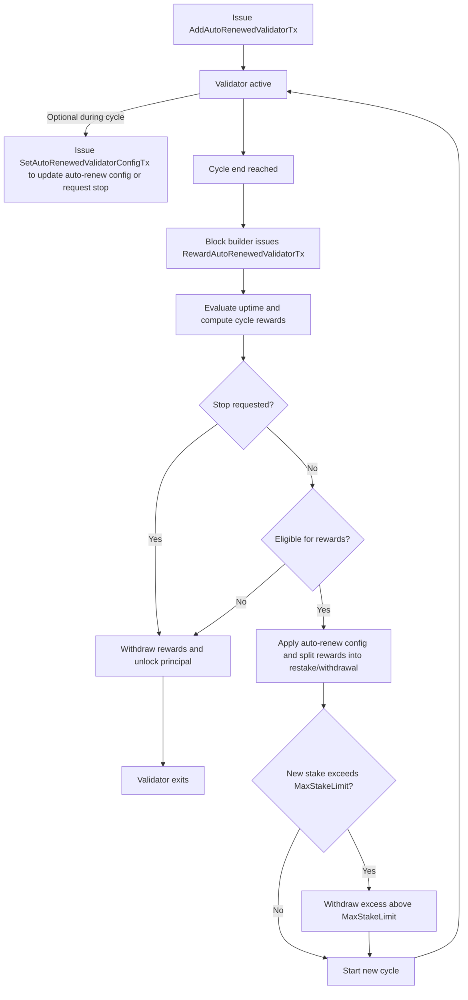

| ACP | 236 |
|:--------------|:------------------------------------------------------------|
| **Title** | Auto-Renewed Staking |
| **Author(s)** | Razvan Angheluta ([@rrazvan1](https://github.com/rrazvan1)) |
| **Status** | Proposed  ([Discussion](https://github.com/avalanche-foundation/ACPs/discussions/244)) |
| **Track** | Standards |

## Abstract

This proposal introduces auto-renewed staking for validators on the Avalanche P-Chain. Validators can renew their staking position automatically, allowing their stake to compound over time, accruing rewards once per specified cycle.
Note that this mechanism applies only to primary network validation. It does not apply to L1 validators or to legacy subnet validators.

## Motivation

The current staking system on the Avalanche P-Chain restricts flexibility for stakers by requiring them to specify an explicit end time for their stake and by enforcing minimum and maximum staking durations, limiting their ability to respond to changing market conditions or liquidity needs. Managing a large number of nodes is also challenging, as re-staking at the end of each period is labor-intensive, time-consuming, and poses security risks due to the required transaction signing. Additionally, tokens can remain idle at the end of a staking period until stakers initiate the necessary transactions to stake them again.

## Specification

Auto-renewed staking introduces a mechanism that allows validators to remain staked indefinitely, without having to manually renew staking transactions at the end of each period.

Instead of committing to a fixed endtime upfront, validators specify a cycle duration (period) and an `AutoCompoundRewardShares` value when they submit an `AddAutoRenewedValidatorTx`. At the end of each cycle, the validator is automatically restaked for a new cycle. The validator (via `Owner`) may update the auto-renew config at any time during a cycle; such updates take effect only at the end of the current cycle. To stop validating, the validator signals intent to stop validating by updating the next cycle’s period to `0`; this causes the validator to gracefully exit at the end of the current cycle and unlock their staked funds. The minimum and maximum cycle lengths follow the same protocol parameters as before (`MinStakeDuration` and `MaxStakeDuration`).

Note: On mainnet, the current configuration is: `MinStakeDuration = 14 days` and `MaxStakeDuration = 365 days`.

Clarification: In the rewards formula, `StakingPeriod` is the cycle’s duration, not the total accumulated time across cycles. Each cycle is treated separately when computing rewards.

Delegator interaction remains unchanged, and the same constraints apply: a delegation period must fit entirely within the validator’s cycle. Delegators cannot delegate across multiple cycles, since there is no guarantee that a validator will continue validating after the current cycle. Essentially, it is not possible to delegate with auto-renewal.

Rewards are accrued once per cycle and are managed according to the `AutoCompoundRewardShares` value: the specified portion is restaked and the remainder withdrawn. Auto-renewal only occurs if the validator is eligible for rewards for that cycle. If the validator is not reward-eligible for the cycle, the validator is forced to exit at the end of the cycle and staked funds are unlocked, and accrued rewards are withdrawn.

If the updated stake weight (previous stake + staking rewards + delegation commission rewards) exceeds `MaxStakeLimit`, only the excess above `MaxStakeLimit` is withdrawn and distributed to `ValidatorRewardsOwner` and `DelegatorRewardsOwner`.

Because of the way `RewardValidatorTx` is structured, multiple instances cannot be issued without resulting in identical transaction IDs. To resolve this, a new transaction type has been introduced for both rewarding and stopping auto-renewed validators: `RewardAutoRenewedValidatorTx`. Along with the validator’s creation transaction ID, it also includes a timestamp.

Auto-renewed validators follow the existing uptime requirements. The main difference is that uptime is measured separately for each cycle. At the end of every cycle, the validator’s uptime during that specific period is evaluated to determine eligibility for rewards. Auto-renewed staking is conditioned on reward eligibility. When a new cycle begins, uptime tracking resets and starts again for the next period.

Note: Submitting an `AddAutoRenewedValidatorTx` immediately followed by a `SetAutoRenewedValidatorConfigTx` that sets the next period to `0` replicates the behavior of the current fixed-period staking system (stake for a single cycle, then gracefully exit).

### Auto-Renew Config

The `Owner` field defines who is authorized to modify the validator's auto-renew config.

The auto-renew config defines the validator's end-of-cycle behavior: whether it continues into the next cycle and how rewards are split between restaking and withdrawal.

At creation, validators set the auto-renew config: `AutoCompoundRewardShares` and `Period`.

`AutoCompoundRewardShares` specifies, in millionths (percentage * 10_000), what portion of earned rewards should be automatically restaked at the end of each cycle. The remaining portion of the rewards will be withdrawn.
For example, a value of 300,000, restakes 30% of the rewards and withdraws 70%.

`Period` defines the duration of the next validation cycle and can be updated during a cycle with changes taking effect at cycle end.

Stopping is requested by setting the next cycle’s `Period` to `0` via `SetAutoRenewedValidatorConfigTx`.

### New P-Chain Transaction Types

The following new transaction types will be introduced to the P-Chain to support this functionality:

#### AddAutoRenewedValidatorTx

```golang
type AddAutoRenewedValidatorTx struct {
  // Metadata, inputs and outputs
  BaseTx `serialize:"true"`
  
  // Node ID of the validator
  ValidatorNodeID ids.NodeID `serialize:"true" json:"nodeID"`
  
  // [Signer] is the BLS key for this validator.
  Signer signer.Signer `serialize:"true" json:"signer"`
  
  // Where to send staked tokens when done validating
  StakeOuts []*avax.TransferableOutput `serialize:"true" json:"stake"`
  
  // Where to send validation rewards when done validating
  ValidatorRewardsOwner fx.Owner `serialize:"true" json:"validationRewardsOwner"`
  
  // Where to send delegation rewards when done validating
  DelegatorRewardsOwner fx.Owner `serialize:"true" json:"delegationRewardsOwner"`

  // Who is authorized to modify the auto-renew config
  Owner fx.Owner `serialize:"true" json:"owner"`
  
  // Fee this validator charges delegators as a percentage, times 10,000
  // For example, if this validator has DelegationShares=300,000 then they
  // take 30% of rewards from delegators
  DelegationShares uint32 `serialize:"true" json:"shares"`

  // Weight of this validator used when sampling
  Wght uint64 `serialize:"true" json:"weight"`

  // Percentage of rewards to restake at the end of each cycle, expressed in millionths (percentage * 10,000).
  // Range [0..1_000_000]:
  //   0         = restake principal only; withdraw 100% of rewards 
  //   300_000   = restake 30% of rewards; withdraw 70%
  //   1_000_000 = restake 100% of rewards; withdraw 0%
  AutoCompoundRewardShares uint32 `serialize:"true" json:"autoCompoundRewardShares"`

  // Period is the validation cycle duration, in seconds.
  Period uint64 `serialize:"true" json:"period"`
}

```

#### SetAutoRenewedValidatorConfigTx

```golang
type SetAutoRenewedValidatorConfigTx struct {
  // Metadata, inputs and outputs
  BaseTx `serialize:"true"`
  
  // ID of the tx that created the auto-renewed validator.
  TxID ids.ID `serialize:"true" json:"txID"`

  // Authorizes this validator to be updated.
  Auth verify.Verifiable `serialize:"true" json:"auth"`

  // Percentage of rewards to restake at the end of each cycle, expressed in millionths (percentage * 10,000).
  // Range [0..1_000_000]:
  //   0         = restake principal only; withdraw 100% of rewards 
  //   300_000   = restake 30% of rewards; withdraw 70%
  //   1_000_000 = restake 100% of rewards; withdraw 0%
  AutoCompoundRewardShares uint32 `serialize:"true" json:"autoCompoundRewardShares"`

  // Period for the next cycle (in seconds). Takes effect at cycle end.
  // If 0, stop at the end of the current cycle and unlock funds.
  Period uint64 `serialize:"true" json:"period"`
}
```

#### RewardAutoRenewedValidatorTx

```golang
type RewardAutoRenewedValidatorTx struct {
  // ID of the tx that created the validator being removed/rewarded
  TxID ids.ID `serialize:"true" json:"txID"`
  
  // End time of the validation cycle.
  Timestamp uint64 `serialize:"true" json:"timestamp"`
}

```

### UTXO Creation

Auto-renewed staking creates UTXOs across different transactions depending on the withdrawal reason:

Attached to `AddAutoRenewedValidatorTx`:
- Initial stake (returned when validator stops)

Attached to `RewardAutoRenewedValidatorTx`:
- Validation/delegatee rewards withdrawn based on `AutoCompoundRewardShares`
- Excess rewards withdrawn when restaking would exceed `MaxValidatorStake`
- Accrued validation/delegatee rewards when validator stops (gracefully or forced)

## Backwards Compatibility

This change requires a network upgrade to make sure that all validators are able to verify and execute the new introduced transactions.

## Considerations

Auto-renewed staking makes it easier for users to keep their funds staked longer than with fixed-period staking, since it involves fewer transactions, lower friction, and reduced risks. Greater staking participation leads to stronger overall network security.

Validators benefit by not having to manually restart at the end of each cycle, which reduces transaction volume and the risk of network congestion.

However, the uptime risk per cycle slightly increases depending on cycle length and validator performance. For example, missing five days in a one-year cycle will still yield validation rewards, whereas missing five days in a two-week cycle may affect rewards.

## Flow of a Validator with Auto-Renewing


## Copyright

Copyright and related rights waived via [CC0](https://creativecommons.org/publicdomain/zero/1.0/).
